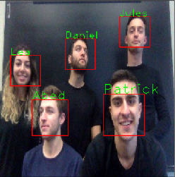

# ECSE415 Project

## DataSet
The dataset for this project by each member of the group generated their own dataset from five different angles (-30, -15, 0, 15, 30) and three different scales (0.5m, 1m, 1.5m). Upon acquisition, the images are resized to a size of 256x256. The images are then passed into our face detection script which then separates the face from the image into a new dataset. Our script uses the opencv Viola-Jones face detector to find the face on the image. 

## Experiments

### Training: Building Vocabulary
For this experiment, we used SIFT to detect keypoints. Using the implemented SIFT function we extracted the keypoint coordinates from each cropped image in our dataset. Then we generated patches for each keypoint using the keypoint coordinates as the center of our patch with a patch size of 15 by 15.
Then, we extracted the HoG features for each patch, and used it to compute the Bag Of Words for for a given image.

### Results

